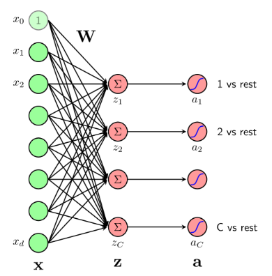
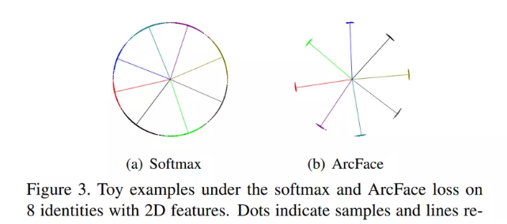

# I. Giới thiệu về ArcFace

Như chúng ta đã tìm hiểu về mô hình FaceNet kèm với `Triplet Loss Function` (hàm loss bộ ba) với 3 bức ảnh: anchor, positive, negative. Mục tiêu của hàm `triplet loss` là giảm khoảng cách giữa 2 vector embedding của những người trong cùng 1 class và tăng khoảng cách giữa 2 vector embedding của 2 người ở 2 class khác nhau.
Về cơ bản thì triplet-loss based method gặp phải 2 vấn đề cơ bản như sau:

- Một là nếu dataset càng lớn, sẽ có sự bùng nổ về số bộ ba triplet samples, dẫn đến sự lặp lại đáng kể các bước.
- Hai làm việc tìm ra các bộ semi-hard samples không phải là chuyện đơn giản.

**Sau đây chúng ta sẽ tìm hiểu về hàm mất mát của ArcFace được lấy ý tưởng từ hàm mất mát của `softmax`** 

# II. Softmax Loss Function
## 1. Hàm Softmax
Trong bài toán phân loại nhị phân chúng ta thường sử dụng các thuật toán như `Logistic Regression` để phân loại 2 nhãn 1 và 0. Vậy với bài toán phân loại nhiều hơn 2 lớp chúng ta có thể áp dụng được `Logistic Regression` hay không?

Hãy nhìn vào bức ảnh dưới đây, đầu vào `x` được kết nối với 1 lớp fully connected để tạo ra `z`. Các giá trị z này được đưa qua hàm `sigmoid` một cách độc lập và không hề có một mối liên kết nào với nhau, ta cũng không đảm bảo được rằng tổng xác suất ở các đầu ra bằng 1. Như vậy Nếu ta khai thác được mối quan hệ giữa các $z_i$ thì kết quả của bài toán classification sẽ tốt hơn.
Vậy chúng ta cần 1 mô hình xác suất sao cho với mỗi input $x, a_i$ thể hiện xác suất để input đó rơi vào class thứ i. Vậy điều kiện là $a_i$ phải dương và tổng các $a_i$ bằng 1. Và thêm 1 điều kiện tự nhiên nữa là : $z_i = w_i^T.x$ càng lớn thì xác suất input `x` thuộc vào lớp đó càng cao. Như vậy chúng ta cần sử dụng 1 hàm đồng biến ở đây. 
Hàm Softmax thoả mãn được các yêu cầu trên đây:

$a_i = \frac{e^{z_i}}{\sum_{j = 1}^{C} e^{z_j}}\ \ \ \forall i = 1, 2, 3, ..., C$

## 2. Hàm mất mất (Loss Fucntion)

Hàm mất mát được xây dựng để tối thiểu hoá sự khác biệt giữa đầu vào và đầu ra. Một lựa chọn đầu tiên có thể nghĩ tới là:
$J(W) = \sum_{i = 1}^{N} ||a_i - y||^2_2$
Tuy nhiên đây chưa phải là một lựa chọn tốt. Khi đánh giá sự khác nhau (hay khoảng cách) giữa hai phân bố xác suất (probability distributions), chúng ta có một đại lượng đo đếm khác hiệu quả hơn. Đại lượng đó có tên là cross entropy.

Cross Entropy giữa 2 đại lượng `p`, `q` được đinh nghĩa như sau:

$H(p, q) = -\sum_{i = 1}^{C} p_ilogq_i$

Với Softmax Regression, trong trường hợp có C class, loss giữa đầu ra dự đoán và đầu ra thực sự được tính như sau:
$J(W) = -\sum_{j = 1}^{C}y_{ij}log(a_{ij})$
Ta sẽ kết hợp tất cả các cặp dự liệu $x_i, y_i$ để tạo ra hàm mất mát cho Softmax Regression:

$J(W) = -\sum_{i = 1}^{N}\sum_{j = 1}^{C} y_{ij}log(a_{ij})$

$=  -\sum_{i = 1}^{N}\sum_{j = 1}^{C} y_{ij}log(\frac{exp(w_j^Tx_i)}{\sum_{k = 1}^{C}exp(w_k^Tx_i)})$ 

Để đơn giản hoá với $y_{ij}$ là vector onehot. Tức là nếu nhãn đúng sẽ là 1, ngược lại là 0. Ta sẽ tóm gón công thức trên lại như sau:
$J(W) = - \sum_{i = 1}^{N}log(\frac{exp(w_{y_i}^Tx_i)}{\sum_{j = 1}^{C}exp(w_j^Tx_i)})$

Phân tích 1 chút: $W^Tx = ||W||.||x||.cos(\theta_j)$. Đây là công thức tích vô hướng nhé !
Các bạn có thể tham khảo link paper tại [đây nhé](https://arxiv.org/pdf/1801.07698.pdf).
Để đơn giản, weight được normalized = 1 bằng cách sử dụng L2 Normalization. Các vector đặc trưng cũng được chuẩn hoá L2 Normalization và re-scaled về bằng s. Sau bước này quá trình predictions chỉ phụ thuộc vào góc giữa features và weight.

$L2 = -\frac{1}{N}\sum_{i=1}^{N}log(\frac{e^{scos\theta_{y_i}}}{e^{scos\theta_{y_i}} + \sum_{j = 1, j\neq y_i}^{N}e^{scos\theta_j}})$

Theo như paper thì các embedding feature được phân phối xung quanh mỗi feature center trên 1 hypershpere (hình cầu trong không gian n chiều), trong paper đề xuất thêm 1 additive angular margin penalty m giữa $x_i$ và $W_{y_i}$
Biên Góc Tăng Cường: Hệ số 𝑚 làm tăng góc $\theta$ giữa vector embedding và vector trọng số của lớp đúng. Điều này tương đương với việc yêu cầu mô hình học phải tạo ra các vector embedding với cosine similarity nhỏ hơn cho các mẫu thuộc cùng một lớp.

Giảm Cosine Similarity: Khi góc θ tăng (do thêm 𝑚), giá trị cosine similarity sẽ giảm (vì $cos(\theta + m) < cos(\theta)$)

Điều này có nghĩa là để đạt được cùng một xác suất dự đoán cho lớp đúng (trong hàm softmax), mô hình phải học các vector embedding sao cho chúng hướng càng gần vector trọng số của lớp đúng càng tốt.

Tăng Khả Năng Phân Tách: Việc giảm cosine similarity yêu cầu mô hình phải tạo ra các vector embedding có sự khác biệt rõ ràng giữa các lớp. Khi các lớp có cosine similarity thấp hơn, các vector embedding của các mẫu thuộc các lớp khác nhau sẽ trở nên xa nhau hơn trong không gian vector. Điều này dẫn đến việc các lớp được phân tách rõ ràng hơn.

Nhìn vào hình có thể thấy sự khác biệt giữa softmax và arcface. Các class trong arcface được phân tách một cách rõ ràng hơn.
