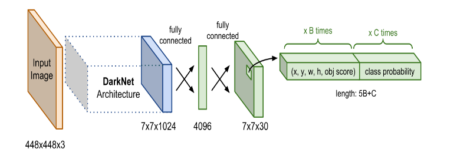

# I. THUẬT TOÁN YOLO
YOLO trong bài toán Object Detection được gọi là `You only look one`. Tức là chỉ cần nhìn một lần là có thể phát hiện được vật thể.
Mặc dù YOLO không phải là thuật toán có độ chính xác cao nhất nhưng nó là thuật toán nhanh nhất trong các lớp mô hình Object Detection. Nó có thể đạt đến tốc độ gần như real-time mà độ chính xác không quá giảm so với các model thuộc top đầu khác.
## 1. Kiến trúc mạng YOLO
Kiến trúc mạng YOLO bao gồm: base network là các mạng CNN có nhiệm vụ trích xuất đặc trưng. Phần phía sau là những Extra Layers được sử dụng để phát hiện các object trên feature map của base network

## 2. Đầu ra của YOLO
Output của YOLO là 1 vector đầu ra nhiều thành phần:
        $y^T = [p_0, (t_x, t_y, t_w, t_h), (p_1, p_2, ..., p_c)]$

Trong đó:

- $p_0$ là xác suất dự báo vật thể xuất hiện trong bouding box.
- $(t_x, t_y, t_w, t_h)$ giúp xác định bouding box.
- $(p_1, p_2, ..., p_c)$ là xác suất dự báo của các classes.

Từng cell của bức ảnh sẽ được dự đoán thành 1 vector dự đoán.
## 3. Dự đoán trên nhiều feature map

Trên mỗi cell của các feature map, giả sử chúng ta sẽ áp dụng 3 anchor box để dự đoán object. Như vậy số lượng anchor box trong 1 mô hình YOLO sẽ là: 3 x 3  = 9 (anchor box).
Ngoài ra, mỗi cell cũng tạo thành 3 anchor box nữa. Vậy với 1 bức ảnh có `s x s` cell thì số lượng anchor box tạo ra sẽ là `s x s x 3` . Với ví dụ trên ảnh thì số lượng anchor box tạo ra sẽ là:
\[
(13\times13+26\times26+52\times52)\times3=10647(anchorbox)
\]
Đây là một số lượng rất lớn và là nguyên nhân khiến cho quá trình huấn luyện YOLO trở nên chậm bởi chúng ta cần dự đoán nhãn và bouding box đồng thời trên 10647 anchor boxes.
## 4. Anchor Box
Để tìm được `Bouding Box` cho vật thể, YOLO sẽ cần các anchor box để làm vật ước lượng. Giả sử 1 cell tạo ra 3 anchor box đều chứa vật thể ở trong. Chúng ta sẽ phải lựa chọn anchor box nào có IOU lớn nhất so với ground truth bouding box.

`Ví dụ`: Ở cell thứ i, ta xác định được 3 anchor bao quanh vật thể. Tuy nhiên chỉ có anchor box có viền xanh đậm nhất được chọn do nó có IOU cao nhất so với ground truth bouding box.
## 6. Hàm loss function
Hàm loss fuction của YOLO được chia thành 2 phần: **$\mathcal{L}_{loc}$** (localization loss) đo lường sai số của bouding box và **$\mathcal{L}_{cls}$** (confidence loss) đo lường sai số của phân phối xác suất của các classes.

Hiểu cơ bản như sau:

- **$\mathcal{L}_{loc}$** là hàm mất mất của bouding box dự đoán so với bouding box thực tế
- **$\mathcal{L}_{cls}$** là hàm mất mát của phân phối xác suất. Trong đó, tổng đầu tiên là mất mát của việc dự đoán trong bouding box đó có chứa vật thể hay không? Tổng thứ 2 là mất mát của việc dự đoán vật thể trong cell.

## 7. Non-max suppression
Do thuật toán YOLO dự báo ra rất nhiều bouding box trên 1 bức ảnh nên đối với những cell có vị trí gần nhau, khả năng khung hình bị overlap là rất cao. Trong trường hợp đó, YOLO sử dụng 1 kĩ thuật gọi là Non-max suppression để giảm bớt các bouding box bị đè lên nhau.

Các bước thực hiện non-max suppression:

- **Bước 1**: Đầu tiên, chúng ta tìm cách loại bỏ các bouding box có score thấp hơn 1 ngưỡng nào đó, thường chọn là 0.5
- **Bước 2**: Đối với các bouding box giao nhau. Ta chọn ra bouding box có xác suất chứa vật thể cao nhất. Sau đó, tính toán chỉ số IOU giữa nó và các bouding box khác.
  
*Nếu giá trị IOU tìm được lớn hơn 1 ngưỡng được đặt ra từ trước, tức là 2 bouding box này đang bị overlap, ta cần loại bỏ những bouding box có xác suất nhỏ hơn và giữ lại bouding box có xác suất cao nhất. Ngược lại, nếu chỉ số IOU này nhỏ đồng nghĩa với việc 2 bouding box này không giao nhau.*

# II. Thuật toán FaceNet
## 1. Khái quát thuật toán FaceNet
Hầu hết các thuật toán nhận diện khuôn mặt `trước Facenet` đều tìm cách biểu diễn khuôn mặt bằng 1 vector embedding thông qua 1 `layer bottle neck` có chức năng giảm chiều dữ liệu.

- Hạn chế của các thuật toán này là số lượng chiều embedding tương đối lớn (thường >= 1000) và ảnh hưởng đến tốc độ của thuật toán. Thường chúng ta phải áp dụng thêm PCA để giảm chiều dữ liệu nhằm tăng tốc độ tính toán.
- Hàm loss fuction chỉ đo lường khoảng cách giữa 2 bức ảnh. Cho nên, trong một đầu vào huấn luyện chỉ đọc được `1 trong 2` khả năng đó là: `sự giống nhau nếu chúng cùng class` và ` sự khác nhau nếu chúng khác class` mà không học được cùng lúc sự giống nhau và khác nhau trên cùng 1 lượt huấn luyện.

FaceNet đã giải quyết được 2 vấn đề trên bằng các hiệu chỉnh nhỏ, nhưng mang lại kết quả đáng kể:

- Base Network áp dụng mạng CNN và giảm chiều dữ liệu xuống 128 chiều. Do đó, tốc độ tính toán nhanh hơn và độ chính xác vẫn được đảm bảo.
- Sử dụng loss function là triplet loss có khả năng học `đồng thời` sự giống nhau giữa 2 bức ảnh cùng nhóm và sự khác nhau giữa 2 bức ảnh khác nhóm.
  
## 2. Triplet Loss
Trong FaceNet, quá trình encoding của mạng CNN đã giúp ta mã hoá bức ảnh về 128 chiều . Sau đó những vector này sẽ là đầu vào cho hàm loss fucntion

Để thực hiện việc train với hàm mất mát `Triplet loss` chúng ta cần lựa chọn 3 bức ảnh: bức ảnh gốc (anchor) được cố định, bức ảnh positive (cùng một người với anchor), bức ảnh negative (của 1 người khác anchor).

Mục tiêu của Triplet Loss là tối thiểu hoá khoảng cách giữa 2 bức ảnh anchor và negative. Tối đa hoá khoảng cách giữa 2 bức ảnh anchor và positive. Như vậy chúng ta cần chọn 3 bức ảnh sao cho:

- Ảnh Anchor và Negative là giống nhau nhất: để sao cho $d(A, N)$ nhỏ nhất. Hiểu nôm na là việc mô hình sẽ phân biệt được bạn và 1 người anh em rất giống bạn.
- Ảnh Anchor và Positive là khác nhau nhất: để sao cho $d(A, P)$ lớn nhất. Tức là với 1 bức ảnh của bạn bây giờ và bức ảnh bạn lúc nhỏ, mô hình học được 2 bức ảnh này là của cùng 1 người thì mô hình mới thực sự thông minh.

Triplot function luôn kì vọng:
$d(A, P) < d(A, N)$

Để tăng mức độ phân biệt chúng ta cộng thêm vào vế trái của biểu thức 1 hệ số biên gọi là $\alpha$. 
Hệ số biên $\alpha$ sẽ giúp cho mô hình không học cách làm cho khoảng cách giữa các cặp positive và negative gần bằng nhau, điều này không đảm bảo được các đặc trưng được phân biết 1 cách rõ ràng.

Hệ số biên $\alpha$ lớn sẽ đòi hỏi mô hình học các đặc trưng phân biệt mạnh mẽ hơn. Một giá trị $\alpha$ nhỏ ít đòi hỏi hơn, nhưng có thể không đủ đảm bảo tính phân biệt tốt giữa các đặc trưng.

$d(A, P) + \alpha < d(A, N)$
$\Rightarrow ||f(A) - f(P)||^2_2 + \alpha <= ||f(A) - f(N)||^2_2$
$\Rightarrow ||f(A) - f(P)||^2_2 -||f(A) - f(N)||^2_2+\alpha <= 0$
`Như vậy hàm loss function là:`
$\mathcal{L}(A, P, N) = \sum_{i=0}^n|f(A_i) - f(P_i)||^2_2 -||f(A_i) - f(N_i)||^2_2+\alpha$

`Mục tiêu chính của chúng ta không phải là nhận diện đúng ảnh positive và negative là cùng cặp hay khác cặp với Anchor. Mục tiêu của chúng ta là giảm thiểu mô hình nhận dạng sai ảnh Negative thành Positive nhất có thể. Như vậy chúng ta cần điều chỉnh hàm loss function như sau:`

$\mathcal{L}(A, P, N) = \sum_{i=0}^nmax(|f(A_i) - f(P_i)||^2_2 -||f(A_i) - f(N_i)||^2_2+\alpha, 0)$

`Các bức ảnh nhận diện đúng thì luôn nhỏ hơn 0, ta không quan tâmm đến vấn đề đó nên ta để hàm max giữa nó và số 0. Ta chỉ quan tâm đến các nhận diện sai làm hàm loss >= 0`

# III. Mô hình Google Inception - V1 (2014)

Mạng Inception-V1 đã giành chiến thắng ở cuộc thi ImageNet năm 2015. Kiến trúc này đã trả lời 1 câu hỏi lớn trong mạng CNN đó là sử dụng `kernel-size` với kích thước bao nhiêu thì hợp lý. Các kiến trúc mạng neuron trước đó đều sử dụng bộ lọc với kich thược đa dạng: `11x11`, `5x5`, `3x3` cho tới nhỏ nhất là `1x1`. Một khám phá được đưa ra là sử dụng đồng thời các bộ lọc này trong 1 khối sẽ mang lại hiệu quả đó gọi là khối `inception`.
**Khối Inception:**

- Khối inception sẽ bao gồm 4 nhánh song song. Các bộ lọc lần lượt là `1x1`, `3x3`, `5x5` được áp dụng trong inception module giúp trích lọc được đa dạng đặc trưng trên những vùng nhận thức có kích thước khác nhau.
- Ở đầu các nhánh 1, 2, 4 từ trên xuống, các phép tích chập `1x1` được sử dụng trên từng điểm ảnh như 1 kết nối `fully-connected` nhằm mục đích giảm độ sâu kênh và số lượng tham số của mô hình. Ví dụ ở block trước có kích thước là `12 x 12 x 256`. Sau khi áp dụng  32 bộ lọc `1x1` thì không thay đổi kích thước chiều dài và chiều rộng nhưng sẽ làm giảm số chiều xuống còn 32. Như vậy ở những layer phía sau đó, chúng ta chỉ cần khởi tạo các bộ lọc có chiều sâu là 32 thay vì 256. Do đó số lượng tham số sẽ giảm đi 1 cách đáng kể. 
- Nhánh thứ 3 từ trên xuống giúp chúng ta giảm chiều dữ liệu bằng  một layer `max-pooling` kích thước `3x3` và sau đó áp dụng bộ lọc kích thước `1x1` để thay đổi số kênh 
- Các nhánh áp dụng padding và stride sao cho đầu ra có cùng kích thước với chiều dài và chiều rộng. Sau đó concatenate toàn bộ kết quả đầu ra của các khối theo kênh để thu được output có kích thước bằng với input.
- Khối Inception được lặp lại 7 lần trong kiến trúc Inception-V1. Toàn bộ mạng bao gồm 22 layers, lớn hơn gấp đôi so với VGG-16. Nhờ áp dụng tích chập `1x1` giúp tiết kiệm số lượng tham số.

# IV. ResNet50

ResNet là kiến trúc được sử dụng phổ biến nhất ở thời điểm hiện tại. ResNet cũng là kiến trúc sớm nhất áp dụng batch normalization. Mặc dù là một mạng rất sâu khi có số lượng layer lên tới 152 nhưng nhờ áp dụng những kỹ thuật đặc biệt mà ta sẽ tìm hiểu bên dưới nên kích thước của ResNet50 chỉ khoảng 26 triệu tham số. Kiến trúc với ít tham số nhưng hiệu quả của ResNet đã mang lại chiến thắng trong cuộc thi ImageNet năm 2015.

Những kiến trúc trước đây thường cải tiến độ chính xác nhờ gia tăng chiều sâu của mạng CNN. Nhưng thực nghiệm cho thấy đến một ngưỡng độ sâu nào đó thì độ chính xác của mô hình sẽ bão hòa và thậm chí phản tác dụng và làm cho mô hình kém chính xác hơn. Khi đi qua quá nhiều tầng độ sâu có thể làm thông tin gốc bị mất đi thì các nhà nghiên cứu của Microsoft đã giải quyết vấn đề này trên ResNet bằng cách sử dụng kết nối tắt.

Các kết nối tắt (skip connection) giúp giữ thông tin không bị mất bằng cách kết nối từ layer sớm trước đó tới layer phía sau và bỏ qua một vài layers trung gian. Trong các kiến trúc base network CNN của các mạng YOLOv2, YOLOv3 và gần đây là YOLOv4 bạn sẽ thường xuyên thấy các kết nối tắt được áp dụng.

ResNet có khối tích chập (Convolutional Bock, chính là Conv block trong hình) sử dụng bộ lọc kích thước 3 x 3 giống với của InceptionNet. Khối tích chập bao gồm 2 nhánh tích chập trong đó một nhánh áp dụng tích chập 1 x 1 trước khi cộng trực tiếp vào nhánh còn lại.

Khối xác định (Identity block) thì không áp dụng tích chập 1 x 1 mà cộng trực tiêp giá trị của nhánh đó vào nhánh còn lại.

Giả sử chúng ta muốn học một hàm ánh xạ $H(x)$. Để đơn giản bạn có thể coi $H(x)$ là 1 hàm rất phức tạp và việc học trực tiếp hàm này rất khó khăn.
**Cách tiếp cận của Residual Learning**
Thay vì cố gắng học trực tiếp $H(x)$, chúng ta tách hàm này ra thành 2 phần:

**1.Hàm nhận dạng (Identity Mapping):** Đây là hàm đơn giản nhất mà mô hình có thể học $H(x) = x$. Điều này nghĩa là đầu vào $x$ đi thẳng qua mà không bị thay đổi. 
**2. Hàm phần dư:** Đây là hàm $F(x)$ mà chúng ta thực sự muốn học, với $F(x) = H(x) - x$. Hàm $F(x)$ đại diện cho `phần dư` mà mô hình cần học thêm để từ $x$ đến được $H(x)$

*Notice: Bạn có thể hiểu 1 cách đơn giản, $x$ là kiến thức mà bạn học được trước đó. Bạn đăng kí một lớp học để học được kiên thức $H(x)$. Như vậy kiến thức $H(x)$ này sẽ là tổng hợp của kiến thức trước đó bạn học được và kiến thức bạn học thêm được từ lớp mà bạn đăng kí đúng không. Vậy trong ý tưởng của khối dư cũng vậy. Hàm mục tiêu $H(x)$ chúng ta chỉ cần học thêm phần dư $F(x)$ là kiến thức mà chúng ta học được từ lớp học thêm. Như thế sẽ đơn giản hơn rất nhiều.*

# V. Kiến trúc mạng Inception-ResNet

Inception-ResNet là một mạng học rất sâu. Cấu tạo của mạng cũng rất đặc biệt. Kiến trúc mạng inception-ResNet sử dụng nhiều khối mạng con như Inception-A, Inception-B, Inception-C, Reduction-A, Reduction-B, Stem. Chính nhữđặc điểm trên cho một mạng inception phần dư với hiệu năng rất tốt. Sau đây là kiến trúc mạng chi tiết:

## 1. Khối STEM

Dữ liệu sẽ lần lượt đi qua các khối tích chập được xếp chồng lên nhau để trích xuất ra các đặc trưng. Mặc dù không mới nhưng đem lại kết quả tốt.
## 2. Khối Inception-A

Khối Inception này gồm 3 nhánh song song. Ba nhánh đều sử dụng các tầng tích chập với `kernel_size` khác nhau để trích xuất đặc trưng. Cụ thể nhánh thứ nhất gồm 1 tầng tích chập `1x1`. Nhánh thứ nhất gồm 1 tầng tích chập `1x1`. Nhánh thứ 2 gồm 1 tầng `1x1` và `3x3`.
Ba nhánh đều sử dụng các tầng tích chập có kích thước khác nhau để trích xuất đặc trưng. Cả 3 nhánh đều sử dụng padding và stride phù hợp đều chiều rộng và chiều cao ở đầu ra không thay đổi.
## 3. Khối Inception-B

Khối B bao gồm 2 nhánh và đơn giản hơn khối A. Nhánh thứ nhất chỉ gồm 1 mạng tích chập `1x1`. Nhánh thứ 2 gồm 3 lớp tích chập `1x1`, `1x7`, `7x1`. Cuối cùng là 1 tầng tích chập `1x1` đều giảm số lượng kênh. 
## 4. Khối Reduction-A

Khối Reduction-A gồm 3 nhánh chính. Cụ thể nhánh thứ nhất là lớp `max-pooling: 3x3`. Nhánh thứ là là 1 lớp tích chấp `3x3`. Nhánh thứ 3 gồm 3 lớp tích chập `1x1`, `3x3`, `3x3`. Ở  tầng cuối của 3 nhánh đều sử dụng `stride = 2` để giảm chiều dài và chiều rộng trước khi thực hiện concatenate.
## 5. Khối Reduction-B

Tương tự như khối Reduction-A, tuy nhiên Khối B gồm 4 nhánh xử lý song song.

