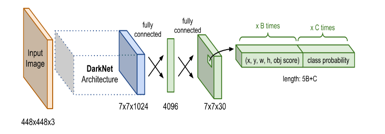
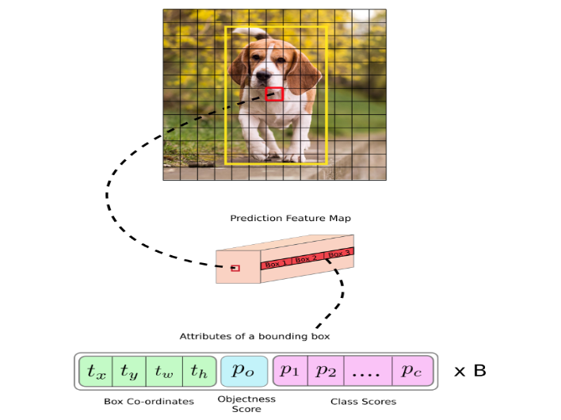
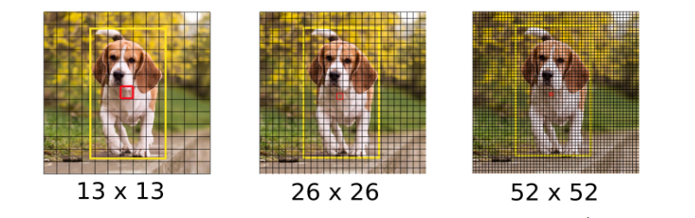
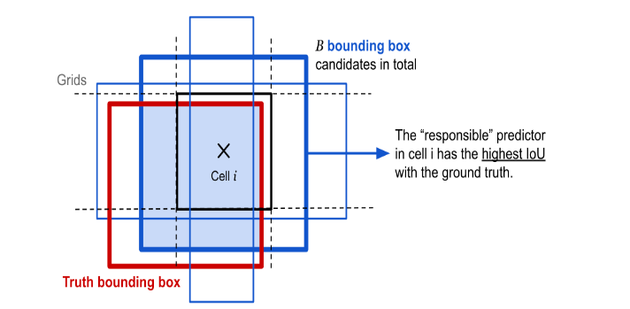
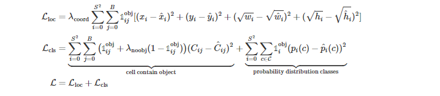
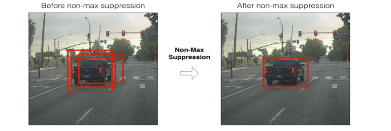
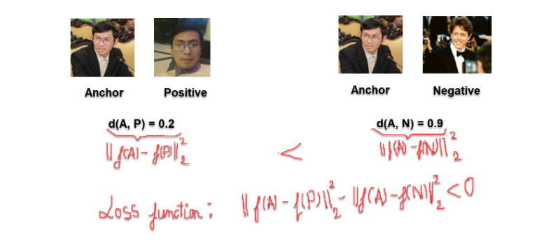

# I. THUẬT TOÁN YOLO
YOLO trong bài toán Object Detection được gọi là `You only look one`. Tức là chỉ cần nhìn một lần là có thể phát hiện được vật thể.
Mặc dù YOLO không phải là thuật toán có độ chính xác cao nhất nhưng nó là thuật toán nhanh nhất trong các lớp mô hình Object Detection. Nó có thể đạt đến tốc độ gần như real-time mà độ chính xác không quá giảm so với các model thuộc top đầu khác.
## 1. Kiến trúc mạng YOLO
Kiến trúc mạng YOLO bao gồm: base network là các mạng CNN có nhiệm vụ trích xuất đặc trưng. Phần phía sau là những Extra Layers được sử dụng để phát hiện các object trên feature map của base network

## 2. Đầu ra của YOLO
Output của YOLO là 1 vector đầu ra nhiều thành phần:
        $y^T = [p_0, (t_x, t_y, t_w, t_h), (p_1, p_2, ..., p_c)]$

Trong đó:

- $p_0$ là xác suất dự báo vật thể xuất hiện trong bouding box.
- $(t_x, t_y, t_w, t_h)$ giúp xác định bouding box.
- $(p_1, p_2, ..., p_c)$ là xác suất dự báo của các classes.

Từng cell của bức ảnh sẽ được dự đoán thành 1 vector dự đoán.
## 3. Dự đoán trên nhiều feature map

Trên mỗi cell của các feature map, giả sử chúng ta sẽ áp dụng 3 anchor box để dự đoán object. Như vậy số lượng anchor box trong 1 mô hình YOLO sẽ là: 3 x 3  = 9 (anchor box).
Ngoài ra, mỗi cell cũng tạo thành 3 anchor box nữa. Vậy với 1 bức ảnh có `s x s` cell thì số lượng anchor box tạo ra sẽ là `s x s x 3` . Với ví dụ trên ảnh thì số lượng anchor box tạo ra sẽ là:
\[
(13\times13+26\times26+52\times52)\times3=10647(anchorbox)
\]
Đây là một số lượng rất lớn và là nguyên nhân khiến cho quá trình huấn luyện YOLO trở nên chậm bởi chúng ta cần dự đoán nhãn và bouding box đồng thời trên 10647 anchor boxes.
## 4. Anchor Box
Để tìm được `Bouding Box` cho vật thể, YOLO sẽ cần các anchor box để làm vật ước lượng. Giả sử 1 cell tạo ra 3 anchor box đều chứa vật thể ở trong. Chúng ta sẽ phải lựa chọn anchor box nào có IOU lớn nhất so với ground truth bouding box.

`Ví dụ`: Ở cell thứ i, ta xác định được 3 anchor bao quanh vật thể. Tuy nhiên chỉ có anchor box có viền xanh đậm nhất được chọn do nó có IOU cao nhất so với ground truth bouding box.
## 6. Hàm loss function
Hàm loss fuction của YOLO được chia thành 2 phần: **$\mathcal{L}_{loc}$** (localization loss) đo lường sai số của bouding box và **$\mathcal{L}_{cls}$** (confidence loss) đo lường sai số của phân phối xác suất của các classes.

Hiểu cơ bản như sau:

- **$\mathcal{L}_{loc}$** là hàm mất mất của bouding box dự đoán so với bouding box thực tế
- **$\mathcal{L}_{cls}$** là hàm mất mát của phân phối xác suất. Trong đó, tổng đầu tiên là mất mát của việc dự đoán trong bouding box đó có chứa vật thể hay không? Tổng thứ 2 là mất mát của việc dự đoán vật thể trong cell.

## 7. Non-max suppression
Do thuật toán YOLO dự báo ra rất nhiều bouding box trên 1 bức ảnh nên đối với những cell có vị trí gần nhau, khả năng khung hình bị overlap là rất cao. Trong trường hợp đó, YOLO sử dụng 1 kĩ thuật gọi là Non-max suppression để giảm bớt các bouding box bị đè lên nhau.

Các bước thực hiện non-max suppression:

- **Bước 1**: Đầu tiên, chúng ta tìm cách loại bỏ các bouding box có score thấp hơn 1 ngưỡng nào đó, thường chọn là 0.5
- **Bước 2**: Đối với các bouding box giao nhau. Ta chọn ra bouding box có xác suất chứa vật thể cao nhất. Sau đó, tính toán chỉ số IOU giữa nó và các bouding box khác.
  
*Nếu giá trị IOU tìm được lớn hơn 1 ngưỡng được đặt ra từ trước, tức là 2 bouding box này đang bị overlap, ta cần loại bỏ những bouding box có xác suất nhỏ hơn và giữ lại bouding box có xác suất cao nhất. Ngược lại, nếu chỉ số IOU này nhỏ đồng nghĩa với việc 2 bouding box này không giao nhau.*

# II. Thuật toán FaceNet
## 1. Khái quát thuật toán FaceNet
Hầu hết các thuật toán nhận diện khuôn mặt `trước Facenet` đều tìm cách biểu diễn khuôn mặt bằng 1 vector embedding thông qua 1 `layer bottle neck` có chức năng giảm chiều dữ liệu.

- Hạn chế của các thuật toán này là số lượng chiều embedding tương đối lớn (thường >= 1000) và ảnh hưởng đến tốc độ của thuật toán. Thường chúng ta phải áp dụng thêm PCA để giảm chiều dữ liệu nhằm tăng tốc độ tính toán.
- Hàm loss fuction chỉ đo lường khoảng cách giữa 2 bức ảnh. Cho nên, trong một đầu vào huấn luyện chỉ đọc được `1 trong 2` khả năng đó là: `sự giống nhau nếu chúng cùng class` và ` sự khác nhau nếu chúng khác class` mà không học được cùng lúc sự giống nhau và khác nhau trên cùng 1 lượt huấn luyện.

FaceNet đã giải quyết được 2 vấn đề trên bằng các hiệu chỉnh nhỏ, nhưng mang lại kết quả đáng kể:

- Base Network áp dụng mạng CNN và giảm chiều dữ liệu xuống 128 chiều. Do đó, tốc độ tính toán nhanh hơn và độ chính xác vẫn được đảm bảo.
- Sử dụng loss function là triplet loss có khả năng học `đồng thời` sự giống nhau giữa 2 bức ảnh cùng nhóm và sự khác nhau giữa 2 bức ảnh khác nhóm.
  
## 2. Triplet Loss
Trong FaceNet, quá trình encoding của mạng CNN đã giúp ta mã hoá bức ảnh về 128 chiều . Sau đó những vector này sẽ là đầu vào cho hàm loss fucntion

Để thực hiện việc train với hàm mất mát `Triplet loss` chúng ta cần lựa chọn 3 bức ảnh: bức ảnh gốc (anchor) được cố định, bức ảnh positive (cùng một người với anchor), bức ảnh negative (của 1 người khác anchor).

Mục tiêu của Triplet Loss là tối thiểu hoá khoảng cách giữa 2 bức ảnh anchor và negative. Tối đa hoá khoảng cách giữa 2 bức ảnh anchor và positive. Như vậy chúng ta cần chọn 3 bức ảnh sao cho:

- Ảnh Anchor và Negative là giống nhau nhất: để sao cho $d(A, N)$ nhỏ nhất. Hiểu nôm na là việc mô hình sẽ phân biệt được bạn và 1 người anh em rất giống bạn.
- Ảnh Anchor và Positive là khác nhau nhất: để sao cho $d(A, P)$ lớn nhất. Tức là với 1 bức ảnh của bạn bây giờ và bức ảnh bạn lúc nhỏ, mô hình học được 2 bức ảnh này là của cùng 1 người thì mô hình mới thực sự thông minh.

Triplot function luôn kì vọng:
\[
d(A, P) < d(A, N)
\]
Để tăng mức độ phân biệt chúng ta cộng thêm vào vế trái của biểu thức 1 hệ số biên gọi là $\alpha$. 
>*Hệ số biên $\alpha$ sẽ giúp cho mô hình không học cách làm cho khoảng cách giữa các cặp positive và negative gần bằng nhau, điều này không đảm bảo được các đặc trưng được phân biết 1 cách rõ ràng.*

>*Hệ số biên $\alpha$ lớn sẽ đòi hỏi mô hình học các đặc trưng phân biệt mạnh mẽ hơn. Một giá trị $\alpha$ nhỏ ít đòi hỏi hơn, nhưng có thể không đủ đảm bảo tính phân biệt tốt giữa các đặc trưng.*

$d(A, P) + \alpha < d(A, N)$
$\Rightarrow ||f(A) - f(P)||^2_2 + \alpha <= ||f(A) - f(N)||^2_2$
$\Rightarrow ||f(A) - f(P)||^2_2 -||f(A) - f(N)||^2_2+\alpha <= 0$
`Như vậy hàm loss function là:`
$\mathcal{L}(A, P, N) = \sum_{i=0}^n|f(A_i) - f(P_i)||^2_2 -||f(A_i) - f(N_i)||^2_2+\alpha$

`Mục tiêu chính của chúng ta không phải là nhận diện đúng ảnh positive và negative là cùng cặp hay khác cặp với Anchor. Mục tiêu của chúng ta là giảm thiểu mô hình nhận dạng sai ảnh Negative thành Positive nhất có thể. Như vậy chúng ta cần điều chỉnh hàm loss function như sau:`

$\mathcal{L}(A, P, N) = \sum_{i=0}^nmax(|f(A_i) - f(P_i)||^2_2 -||f(A_i) - f(N_i)||^2_2+\alpha, 0)$

`Các bức ảnh nhận diện đúng thì luôn nhỏ hơn 0, ta không quan tâmm đến vấn đề đó nên ta để hàm max giữa nó và số 0. Ta chỉ quan tâm đến các nhận diện sai làm hàm loss >= 0`

