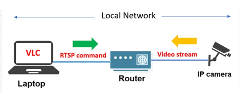
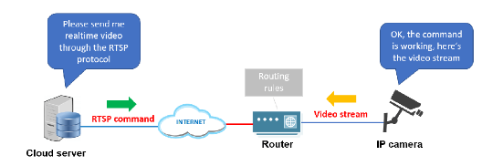

# RTSP và cách hoạt động của RTSP trên camera an ninh

## Giao thức RTSP là gì?

RTSP là một giao thức truyền tin thời gian thực (Real time streaming protocol) được sử dụng để kiểm soát các máy chủ phát trực tiếp sử dụng trong các hệ thống giải trí và truyền thông. Máy chủ RTSP nằm giữa luồng trực tiếp và người xem, đưa ra các lệnh phát, tạm dừng và tua lại. RTSP thường được sử dụng trên camera IP. Đó là lý do mà chúng ta có thể xem trực tiếp những gì camera quan sát được trên màn hình điện thoại thông minh.

## Lịch sử phát triển của RTSP

Giao thức RTSP đã có từ khá lâu. Nó là thành quả của sự hợp tác giữa RealNetworks, Netscape và Đại học Columbia vào năm 1996. Giao thức RTSP được phát triển nhằm mục đích "cung cấp điều khiển giống như đầu VCR", tức là bạn có thể phát, tạm dừng hoặc tua lại nội dung đa phương tiện theo ý muốn.

Hai năm sau (1998), RTSP được tiêu chuẩn hóa với tên gọi RFC 2326. Ngay lập tức, giao thức này trở nên hữu ích và phổ biến vì nó cho phép người dùng điều khiển trực tiếp các nội dung đa phương tiện trên Internet (âm nhạc hoặc video) mà không phải tải tệp xuống thiết bị như trước đó.
RTSP được xây dựng dựa trên các tiêu chuẩn hiện có của thời điểm đó. Nó cũng giống với cách mà giao thức HTTP đang hoạt động (nên cả hai hoạt động tốt với nhau) và có thể sử dụng SDP (Session Description Protocol được chuẩn hóa năm 1998) cho các phiên truyền thông đa phương tiện.

Về cơ bản, RTSP là một giao thức điều khiển truyền thông mạng ở tầng ứng dụng. Nó giao tiếp với máy chủ đa phương tiện để thiết lập phiên và gửi các lệnh như “Tạm dừng” và “Phát” thay vì truyền dữ liệu dưới dạng luồng thực tế. Theo truyền thống, hầu hết các máy chủ RTSP cũng sử dụng RTP (Real Time Transfer Protocol) và RTCP (RTP Control Protocol) để phân phối các luồng dữ liệu đa phương tiện của chúng.

Với quá nhiều lợi ích, RTSP được sử dụng cho nhiều mục đích khác nhau như thuyết trình trực tiếp, các trang web camera IP, học trực tuyến và nghe FM qua Internet. Sau đó, nó tiếp tục được đưa vào các nền tảng đa phương tiện hàng đầu như YouTube và Spotify, các ứng dụng truyền thông như Skype và trình phát đa phương tiện VLC.

Vào năm 2016, Anup Rao và Rob Lanphier đã đề xuất phiên bản RTSP 2.0 với các nâng cấp nhằm rút ngắn thông tin liên lạc giữa máy chủ đa phương tiện và máy khách của người dùng cũng như giải quyết một số vấn đề với biên dịch địa chỉ mạng (NAT).

Ngày nay, RTSP thường được sử dụng như một giao thức đóng góp. Điều đó có nghĩa là một nội dung đa phương tiện sẽ được truyền trực tuyến đến người xem thông qua giao thức khác. Tuy nhiên, RTSP vẫn là giao thức chính được lựa chọn cho camera IP, các công nghệ giám sát, CCTV và hội nghị trực tuyến.

## Nguyên lí hoạt động của giao thức RTSP

RTSP phụ thuộc vào 1 máy chủ phát trực tiếp và dựa vào RTP để truyền nội dung đa phương tiện. Chính vì thế mà giao thức này không hỗ trợ mã hoá nội dung hoặc truyền lại các gói tin bị mất. 

Để có thể hoạt động hoàn hảo với giao thức HTTP, bạn cũng thường phải cần thêm phần mềm bổ sung trên trình duyệt web. Do những hạn chế này, RTSP đang dần bị lu mờ bởi những giao thức và công nghệ phát trực tuyến mới hơn.
Bây giờ, việc phát trực tuyến video thường chỉ dùng RTSP/RTP như là một giao thức đóng góp (hoặc hỗ trợ) ở giai đoạn đầu tiên. Sau đó, các dữ liệu đa phương tiện được phân phối và mã hóa bởi một giao thức khác để có thể phát nội dung trên nhiều loại thiết bị khác nhau.

